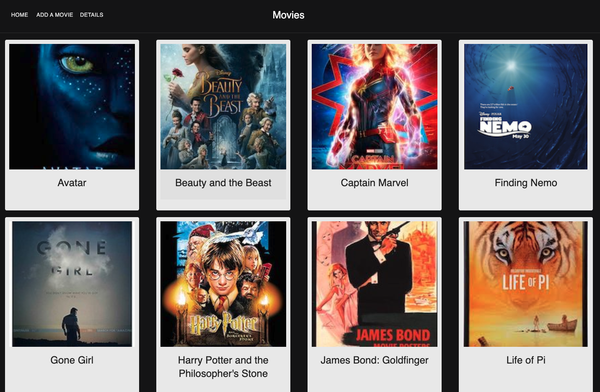

# Project Name

Movie Database

## Description

Duration: 3 day sprint

Solving and Background: 

This app solved the problem of concisely storing all your basic favorite movie information in one place. It displays your favorite movies' posters and with a click on the image the basic information information is displayed.

### ScreeShots

### Prerequisites
    Node.js
    Postgres

### Installation

1. Start your installation by opening your editor of choice and run npm install. 
2. Use the data and statements in the database.sql file to create a database, tables and starter data. 
3. Npm run server, npn run client and it is set to go! 

### Usage 
A user may browse movies on the home page and select a movie of choice by clicking on the poster. this takes a user to a details page where, description and genre are also displayed. From this screen the user may return home or choose to edit any of the content of the movie. 

### Built With: 

-React -ReactRouter -Redux -MaterialUI -Axios -PostGreSQL -Node.js

### Acknowledgement:

Thanks to Prime Digital Academy who equipped and helped me to make this application a reality. Thanks especially to Dane and Kris.

### Support:

If you have suggestions or issues, please email me at jpmzurk@gmail.com

